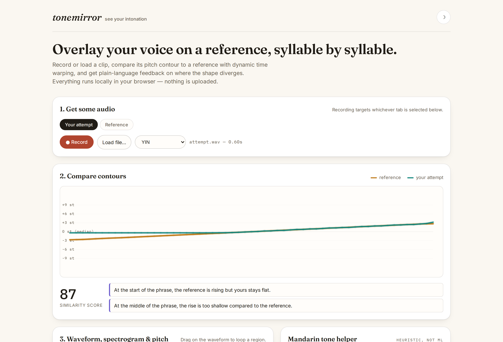
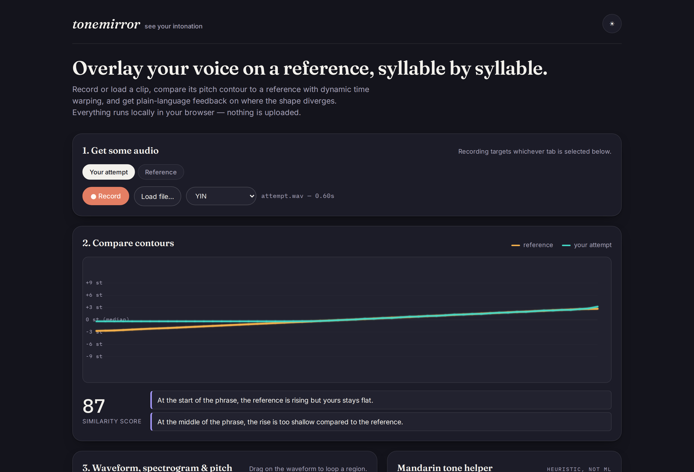
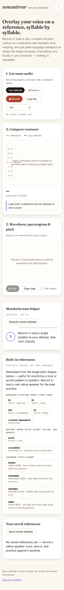

# tonemirror

**See your intonation.** Record a phrase, overlay your pitch contour on a
reference, and practice tones and pitch accent - entirely in the browser.

[](https://github.com/antonsoo/tonemirror/actions/workflows/ci.yml)
[](LICENSE)
[](https://antonsoo.github.io/tonemirror/)

Learners of tonal languages (Mandarin, Cantonese, Vietnamese, Thai) and
pitch-accent languages (Japanese, Ancient Greek) run into the same wall:
you can *hear* that your tone is wrong, but you usually can't tell *how* -
whether the rise started late, didn't go high enough, or was the wrong
shape entirely. A pitch contour makes that visible. tonemirror records (or
loads) audio, tracks its fundamental frequency with a from-scratch DSP
pipeline, aligns it to a reference with dynamic time warping, and turns the
misalignment into plain-language feedback like *"the rise is too shallow"*
or *"your pitch peak comes later than the reference's."*

Nothing leaves your device: no uploads, no accounts, no analytics.



_Reference: a clean, synthetic Mandarin tone 2 (rising). Attempt: a synthetic clip built with a deliberately flat start and shallow rise. Both example clips ship in [`examples/`](examples/); load `mandarin-tone2-reference.wav` as the reference and `mandarin-tone2-attempt-late-rise.wav` as the attempt to reproduce this screenshot._

## Quickstart

```sh
git clone https://github.com/antonsoo/tonemirror.git && cd tonemirror
npm install
npm run dev
```

Open the printed `localhost` URL, click **Load file...** under "Reference"
and load `examples/mandarin-tone2-reference.wav`, then do the same under
"Your attempt" with `examples/mandarin-tone2-attempt-late-rise.wav` - or
just click one of the built-in reference chips and record yourself.

## Features

- **Audio in:** record with the microphone, or load a wav/mp3/ogg/m4a file
  (anything the browser's `decodeAudioData` supports). Recordings you save
  are kept in IndexedDB so you can record a teacher or native speaker once
  and practice against it indefinitely.
- **Pitch tracking**, implemented from scratch in TypeScript, running in a
  Web Worker: YIN and the McLeod Pitch Method (MPM), with voicing
  detection, octave-error correction, median smoothing, and semitone
  normalization relative to the speaker's own median pitch (see
  [Why semitones](#why-semitones-not-hz) below).
- **Comparison:** dynamic time warping between the reference's and
  attempt's voiced frames, a 0-100 similarity score, and honest, rule-based
  localized feedback (direction, steepness, and peak-timing checks per
  third of the phrase).
- **Visualization:** a signature contour "staff" (reference vs. attempt,
  after DTW alignment) plus a waveform + own-FFT spectrogram view with a
  synced playhead, a draggable loop region, and half-speed playback.
- **Mandarin tone helper:** a heuristic classifier for isolated syllables
  (tone 1 high-level, tone 2 rising, tone 3 low/dipping, tone 4 falling,
  neutral), reporting a confidence and the shape feature that drove the
  call. Explicitly labeled heuristic, not ML.
- **Pitch-accent templates:** Ancient Greek acute (rise) and circumflex
  (rise-fall), reconstruction-based; Japanese heiban/atamadaka/nakadaka/
  odaka as target shapes over a word's morae plus a following particle.
- **Built-in references:** synthetic harmonic-complex voices for the four
  Mandarin tones and every accent template, generated in-browser and
  labeled synthetic everywhere they appear. Recording or loading real
  native-speaker audio is one click away and clearly encouraged in the UI.
- **Works offline after first load**, no telemetry, small bundle (~36 kB
  of JS across the main bundle + worker + worklet, uncompressed - see
  [Bundle size](#bundle-size)).

Light and dark themes follow the system preference (with a manual toggle),
and the layout holds up down to a 375px-wide phone:

 

## How it works

### Pitch tracking

Each analysis frame is 2x the lag corresponding to the minimum trackable
frequency (default 60 Hz), hopped every 10 ms. Two independent F0
estimators are available:

- **YIN** ([de Cheveigné & Kawahara, 2002](https://doi.org/10.1121/1.1458024)):
  the difference function `d(tau)`, its cumulative-mean normalization
  `d'(tau)`, an absolute threshold walked to the local minimum, and
  parabolic interpolation for sub-sample lag precision. `src/core/yin.ts`.
- **McLeod Pitch Method / MPM** ([McLeod & Wyvill, 2005](https://www.cs.otago.ac.nz/graphics/Geoff/tartini/papers/A_Smarter_Way_to_Find_Pitch.pdf)):
  the Normalized Square Difference Function (NSDF), key-maximum peak
  picking with a clarity threshold chosen to prefer the true fundamental
  over its octave, and parabolic interpolation. `src/core/mpm.ts`.

After per-frame detection, `src/core/pitchTrack.ts` applies:

1. **Octave-error correction** - a frame whose F0 is ~2x or ~0.5x its local
   voiced-neighborhood median gets snapped back, a classic autocorrelation
   failure mode.
2. **Median smoothing** over voiced frames (unvoiced gaps are left alone so
   voicing boundaries don't get smeared).
3. **Semitone normalization**, described next.

#### Why semitones, not Hz

The whole point of overlaying two contours is comparing their *shape* - is
the rise as steep, does the dip land in the same place - not their
absolute pitch. A male reference speaker and a female or child learner can
differ by an octave or more in raw Hz, which would swamp any Hz-based
comparison. Converting each contour to semitones relative to *its own*
voiced median (`12 * log2(f0 / medianF0)`) puts both speakers on the same
scale regardless of their natural register, so the DTW and visual overlay
are comparing contour shape, which is what actually carries tone and pitch
accent.

### Comparison (DTW)

`src/core/dtw.ts` runs classic dynamic time warping (Sakoe-Chiba DP,
symmetric step pattern, absolute-difference local cost) between the two
contours' voiced semitone sequences. The mean cost per warping step maps
to a 0-100 score via `100 * exp(-meanCost / 2.8)` (a 2.8-semitone average
divergence roughly halves the score). The same alignment path also time-
warps the attempt onto the reference's timeline for the "after alignment"
overlay, and drives rule-based feedback: for each third of the phrase, the
reference's and attempt's local slopes are compared for direction
(rising/falling/flat) and steepness, plus a check on how far apart the two
contours' pitch peaks land in time.

### Mandarin tone classifier

`src/core/toneClassifier.ts` resamples a syllable's semitone contour to 16
points and applies a small decision tree over shape features (pitch range,
where the minimum falls, start/end position relative to the minimum, and
the Pearson correlation with a rising ramp) to call flat / dipping /
rising / falling / short-and-flat (neutral), matching the four citation
tones' canonical shapes from [Chao's five-point pitch scale](https://en.wikipedia.org/wiki/Tone_letter)
(Y. R. Chao, "A system of 'tone-letters'," *Le Maître Phonétique*, 45,
24-27, 1930). It only looks at the contour's relative shape, so it cannot
by itself tell "consistently high" from "consistently low" citation
tones - see [Limitations](#limitations-and-accuracy-caveats).

### Pitch-accent templates

- **Ancient Greek** acute (rise) and circumflex (rise-fall on a long
  vowel/diphthong), per the pitch reconstruction in W. S. Allen, *Vox
  Graeca: A Guide to the Pronunciation of Classical Greek*, 3rd ed.
  (Cambridge University Press, 1987). No audio of Ancient Greek survives;
  this is a scholarly reconstruction, not a recording of a real accent.
- **Japanese** heiban/atamadaka/nakadaka/odaka as target high/low shapes
  over a word's morae plus a following particle - the four-way
  distinction is standard in Japanese phonology teaching, e.g. T. Vance,
  *The Sounds of Japanese* (Cambridge University Press, 2008).

### Synthetic references

`src/core/synth.ts` builds a harmonic complex (fundamental + partials with
a 1/k rolloff and a few fixed formant-like resonance bumps) whose
instantaneous F0 follows a target semitone contour, with optional vibrato,
jitter, and additive noise - used both for the built-in reference library
(always labeled "synthetic" in the UI) and for the accuracy tests below.

### Spectrogram

`src/core/fft.ts` is an iterative radix-2 Cooley-Tukey FFT (bit-reversal
permutation + butterfly passes), used both by the spectrogram (Hann-
windowed STFT, `src/core/spectrogram.ts`) and by the test suite to verify
the synthetic references land at their intended frequency.

## Accuracy and limitations

### Measured accuracy

Generated by `npm run bench` (`scripts/accuracy-report.ts`) against
synthetic signals with exactly known ground-truth F0 - see
`src/core/synth.ts` for signal generation and `src/core/metrics.ts` for
the metric definitions. **Gross pitch error (GPE)** is the fraction of
voiced frames off by more than 20% (~3.15 semitones); **fine pitch MAE**
is the mean absolute error in cents over the remaining (non-gross-error)
frames, so a handful of octave slips don't dominate the headline number -
this is the standard split used in F0-estimation evaluation. Machine: this
box (14 vCPU WSL2 Linux, 48 GB RAM). Sample rate 44100 Hz, 10 ms hop,
search range 60-1000 Hz.

| Condition | Algorithm | Voicing recall | Gross error rate | Fine pitch MAE (cents) |
|---|---|---:|---:|---:|
| Pure tone, 220 Hz | YIN | 100.0% | 0.0% | 0.118 |
| Pure tone, 220 Hz | MPM | 100.0% | 0.0% | 0.048 |
| Harmonic complex, 150 Hz, missing fundamental | YIN | 100.0% | 0.0% | 0.078 |
| Harmonic complex, 150 Hz, missing fundamental | MPM | 100.0% | 0.0% | 0.046 |
| Harmonic complex, 180 Hz + vibrato (5 Hz, +-50 cents) | YIN | 100.0% | 0.0% | 5.4 |
| Harmonic complex, 180 Hz + vibrato (5 Hz, +-50 cents) | MPM | 100.0% | 0.0% | 1.8 |
| Linear glide, 150 -> 300 Hz over 1s | YIN | 100.0% | 0.0% | 6.9 |
| Linear glide, 150 -> 300 Hz over 1s | MPM | 100.0% | 0.0% | 0.876 |
| Harmonic complex, 180 Hz, white noise SNR 20dB | YIN | 100.0% | 0.0% | 0.266 |
| Harmonic complex, 180 Hz, white noise SNR 20dB | MPM | 100.0% | 0.0% | 0.163 |
| Harmonic complex, 180 Hz, white noise SNR 10dB | YIN | 100.0% | 0.0% | 2.5 |
| Harmonic complex, 180 Hz, white noise SNR 10dB | MPM | 100.0% | 0.0% | 1.9 |
| Harmonic complex, 180 Hz, white noise SNR 0dB | YIN | 93.8% | 64.8% | 10.9 |
| Harmonic complex, 180 Hz, white noise SNR 0dB | MPM | 4.1% | 25.0% | 11.0 |

Reading this honestly: both detectors are excellent on clean and
moderately noisy signals (sub-2-cent error, the practical use case for a
quiet-room recording), MPM tracks fast glides and vibrato noticeably
better than YIN (its NSDF window responds faster to a changing period),
and *both* detectors degrade hard at 0dB SNR (signal and noise equal
power) - YIN keeps producing (increasingly wrong) estimates, while MPM's
clarity threshold correctly refuses to call most frames voiced at all
rather than guess. Neither is a recommendation to use the app in a loud
room. `tests/pitchTrack.test.ts` encodes looser versions of these bounds
as regression tests; `tests/yin.test.ts`, `tests/mpm.test.ts`,
`tests/fft.test.ts`, `tests/dtw.test.ts`, `tests/toneClassifier.test.ts`,
`tests/accentTemplates.test.ts`, `tests/synth.test.ts`, and
`tests/spectrogram.test.ts` cover the rest of the core, including DTW
correctness on hand-computed small cases and the tone classifier against
every citation tone's synthetic contour.

### Limitations and accuracy caveats

- **Real rooms are not synthetic signals.** Background noise, reverb, and
  cross-talk all degrade pitch tracking; the noise-SNR rows above are a
  reasonable proxy but not a guarantee for any particular microphone or
  room.
- **Creaky voice (vocal fry)** produces an irregular, sometimes
  sub-harmonic glottal pulse train that both YIN and MPM can mis-track;
  neither algorithm has special handling for it.
- **Connected speech and tone sandhi** (e.g. Mandarin's third-tone sandhi,
  where a tone changes shape based on its neighbors) are out of scope -
  this app compares isolated phrases/syllables, not the tone-sandhi rules
  of running speech.
- **The Mandarin tone classifier is shape-only.** It normalizes each
  syllable's own contour, so it cannot use absolute register to
  distinguish, say, a consistently high citation form from a consistently
  low one without surrounding context; it also has no model of neutral
  tone's real conditioning (the preceding tone), only a duration/range
  heuristic.
- **Ancient Greek accent is a scholarly reconstruction**, not a recording
  of a real speaker - no audio of Ancient Greek exists. Treat the
  templates as a teaching aid, not ground truth.
- **The synthetic voice model is not a vocoder.** It's additive harmonic
  synthesis with a few fixed resonance bumps, good enough to exercise the
  pitch tracker and to demonstrate tone/accent shapes, not a substitute
  for a real speaker's timbre.

## Bundle size

`npm run build` output on this box:

```
dist/assets/recorderWorklet-*.js   0.22 kB
dist/index.html                    1.30 kB
dist/assets/pitchWorker-*.js       6.16 kB
dist/assets/index-*.css            9.56 kB (gzip 2.45 kB)
dist/assets/index-*.js            30.00 kB (gzip 11.32 kB)
```

No UI framework, no charting library - Canvas 2D and vanilla DOM.

## Development

```sh
npm run dev         # Vite dev server
npm test             # Vitest (51 tests, Node - no browser needed)
npm run lint          # ESLint (typescript-eslint, type-checked rules)
npm run typecheck      # tsc --noEmit, strict mode
npm run build            # typecheck + production build
npm run bench              # regenerate the accuracy table above
```

See [CONTRIBUTING.md](CONTRIBUTING.md) for the project layout.

## Contributing

Issues and PRs welcome. Run the full check (`lint`, `typecheck`, `test`,
`build`) before opening a PR - see [CONTRIBUTING.md](CONTRIBUTING.md).

## License

[MIT](LICENSE) (c) 2026 Anton Soloviev
